# CHAPTER 1: The Machine Learning Landscape

## Day 1 (20/2/2024)

Bài đặt ra vấn đề khi hỏi **Machine Learning** chính xác là gì? Việc một machine mà learn something nghĩa là gì? Liệu tải một kho dữ liệu như Wiki về máy tính, máy tính có thể "learn" được không?
## What is Machine Learning?

**Machine Learning** is the science (and art) of programming computers so they can learn from data.

Ví dụ, bạn có một công cụ để lọc spam dựa trên **Machine Learning** có thể học từ việc đánh dấu những ví dụ các emails spam và các emails không phải là spam.\
Các ví dụ mà chương trình học gọi là ***training set***. Từng ví dụ là ***training instance*** (hoặc ***sample***).\
Phần mà **Machine Learning** học và tạo ra dự báo gọi là **model**. \
Khi mà máy dự đoán, ta có thể set một tỷ lệ dự đoán chính xác mà ta muốn máy dự đoán. Đó là **accuracy**.\
Quay lại vấn đề nên ở đầu bài, việc download dữ liệu Wiki giúp máy tính chúng ta có thêm nhiều data nhưng khôn giúp tốt lên. Đó không phải là **Machine Learning**.

## Why Use Machine Learning?
Quay trở lại ví dụ về làm một chương trình về lọc emails spam.\
Một technique truyền thống chúng ta có thể sử dụng khi làm chương trình đó là:
- Đầu tiên xem thử các email spam thì trông như nào. VD: Các email spam hay có chữ "4U", "credit card", "free" hay "amazing" trong nội dung email.
- Tiếp theo viết thuật toán để có thể detect được các pattern mà mình nhận ra, và chương trình sẽ đánh flag nếu một số pattern trong rule mình đưa ra được detect.
- Cuối cùng sẽ test chương trình, lặp lại bước 1 và 2 đến khi chương trình đủ tốt.

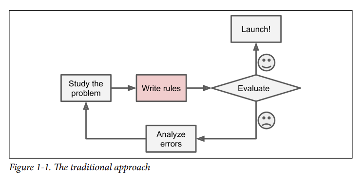

Nếu làm theo cách truyền thống này, chúng ta sẽ rất khó khăn khi viết được rules phù hợp và cover được các case.\
Chính vì vậy, **Machine Learning** sẽ giúp chương trình lọc spam email có thể tự động học từ bộ data mà mình dưa cho để tìm và đưa ra các pattern để phân biệt email nào spam và không spam. Chúng ta sẽ không cần phải viết rules cho chương trình nữa. Việc này sẽ nhanh hơn, dễ dàng maintain và chính xác hơn so cách truyền thống.\
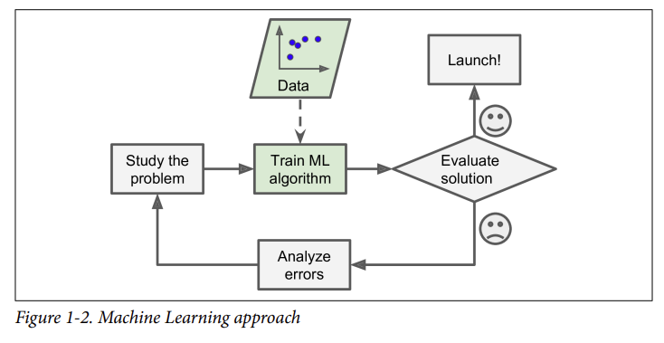

Nếu spammers biết các email spam bị block do có chữ "4U" và chuyển sang thành "For U" thì sẽ như thế nào?\
Một chương trình truyền thống thì chúng ta cần phải kiểm tra và update thường xuyên để đánh dấu lại. Tuy nhiên, một chương trình sử dụng ML sẽ tự động học data cho thêm và nhận ra "For U" là một pattern cần detect để gắn flag cho việc spam email.\
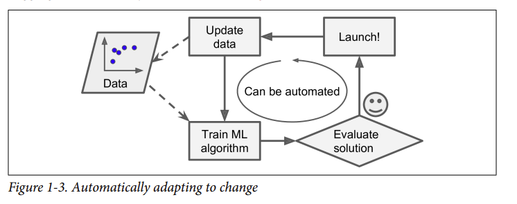

Mở rộng hơn, **Machine Learning** có thể xử lý một số vấn đề mà thuật toán truyền thống không xử lý được. Ví dụ như speech recognition, ta chỉ muốn một chương trình đơn giản là khi nghe 1 âm thanh khi chương trình trả ra âm thanh là "one" hay "two". Cách xử lý tốt nhất là viết thuật toán và cho máy tự học dựa trên hàng ngàn, hàng triệu ví dụ khác nhau.\
Cuối cùng, **Machine Learning** có thể tự xem lại chúng đã học những gì. VD với trường hợp email spam, máy có thể phát hiện và đưa ra những từ và cụm từ là best pattern để gắn flag spam. Đôi lúc, chúng sẽ phát hiện cả những correlation hoặc các trends mới, từ đó giúp chúng ta hiểu thêm về bài toán.\
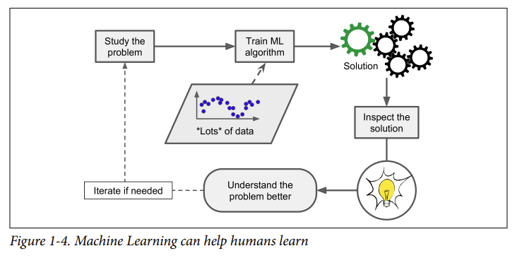\
Nói tóm lại, **Machine Learning** sử dụng tốt khi:
- Các vấn đề nếu dùng phương pháp truyền thống cần viết rules điều chỉnh nhiều hoặc rất dài.
- Các vấn đề khi sử dụng phương pháp truyền thống sẽ không tốt hoặc không xử lý được
- Dữ liệu mới thay đổi và cần update liên tục
- Lấy được insight từ các vấn đề phức tạp và bộ data lớn

## Types of Machine Learning Systems
Có rất nhiều loại **Machine Learning Systems** khác nhau mà chúng ta có thể phân loại dựa trên:
- Liệu chúng có được giám sát trong quá trình training không? (supervised, unsupervised, semi-supervised, self-supervised, and others)
- Liệu chúng có học thêm liên tục khi đang thực hiện? (online versus
batch learning)
- Liệu chúng học bằng cách so sánh new data points với các điểm data points đã biết, hay detect các pattern sử dụng tập training data và build một model dự đoán? (instance-based versus model-based learning)

Nói chung, các cateria này không riêng biệt nhau mà chúng ta có thể combine chúng theo bất cứ nào ta muốn. VD một bộ lọc spam có thể dạng online, model-based, supervised learning system.\
### Training Supervision
Như để cập ở trên, ML systems có thể phân loại dựa trên loại supervision mà chúng dùng trong quá trình training. Chúng ta sẽ tập trung vào: **supervised learning**, **unsupervised learning**, **selfsupervised learning**, **semi-supervised learning**, and **reinforcement learning**.
#### Supervised learning
Trong **Supervised learning**, bạn sẽ đưa 1 tập training bao gồm nhãn đưa vào thuật toán gọi là ***labels***.\
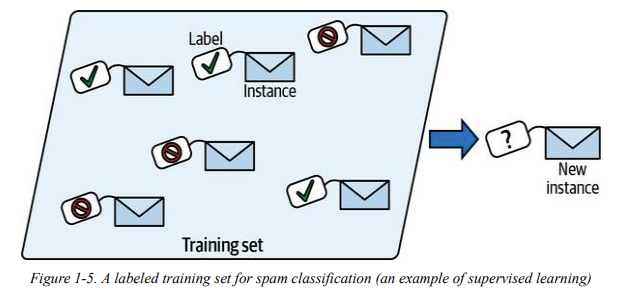\
Một task phổ biến trong **Supervised learning** là ***classification***. Ví dụ như chính trong spam email, máy sẽ được train với rất nhiều email gắn với ***class*** của chúng (spam hoặc không spam), và máy sẽ học để phân loại 1 email mới xem là spam hay không phải spam.\
Một task phổ biến khác đó là ***regression***. Máy sẽ dự đoán một biến ***target*** có thể là giá của xe, nhà,... dựa trên 1 số lượng ***features*** input (Số km đi, tuổi, hãng hiệu xe,...). Để dạy máy, ta cần phải đưa vô số ví dụ của xe gồm ***features*** và ***target*** của xe đó.\
***Regression*** dùng dự đoán một giá trị liên tục. Trong khi ***classification*** dự đoán xem thuộc từng loại đơn lẻ.\
***Note:*** Một số Regression models nhưng dùng trong bài toán ***classification*** và ngược lại. \
Ví dụ, logistics regression có output là một số (như 20% tỷ lệ bị spam) tuy nhiên lại sử dụng trong bài toán classification chẳng hạn nếu chúng ta muốn xác định positive hay negative khi tỷ lệ spam trên dưới 30%. Khi này 20% là positive.\
***Note:*** ***target*** và ***model*** được sử dụng đan xen và gần giống nhau trong  ***supervised learning***. Tuy nhiên, ***target*** hay sử dụng trong bài toán ***regression*** và ***model*** dùng trong bài toán ***classification***.
Hơn nữa, ***features*** cũng có thể được gọi là ***predictors*** hoặc ***attributes***.

#### Unsupervised learning
**Unsupervised learning** là khi máy sẽ học tập training data mà không được gắn label.\
Ví dụ, ta có rất nhiều data về các visitors một trang blog. Chúng ta có thể chạy một thuật toán ***clustering*** để phát hiện các group giống nhau.\
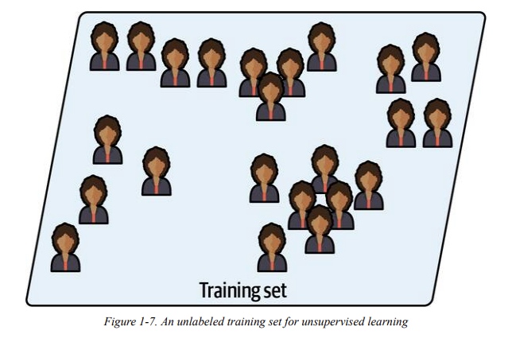\
Khi sử dụng **Unsupervised learning**, không có lúc nào chúng ta nói cho thuật toán biết group mà visitor thuộc về mà chúng sẽ tự tìm connections. \
Ví dụ, máy sẽ nhận ra 40% visitors là teenagers thích đọc sách comic và thường đọc blog của bạn sau khi đi học; 20% là người lớn thích sci-fi và đọc vào cuối tuần. Từ đó, ta có thể tập trung vào nhóm visitors cần hướng tới. \
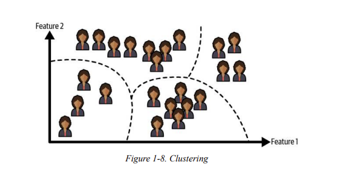\
Thuật toán ***Visualization*** là một ví dụ tốt về **Unsupervised learning**. Chúng ta đưa các data phức tạp và không gắn label và máy sẽ trả ra một plot 2D hoặc 3D. Thuật toán sẽ cố gắng giữ nguyên các nhiều cấu trúc có thể (ví dụ như giữ các cụm riêng biệt trong input không chồng chéo khi trực quan hóa) để chúng ta dễ dàng nhìn data và nhận ra các patterns rõ ràng hơn.\
Một task liên quan là ***dimensionality reduction***, khi mục tiêu của chúng là đơn giản hóa data mà không làm mất quá nhiều thông tin. Một cách đó là việc merge các features liên quan nhau thành 1 feature. \
Ví dụ, chiều rộng và chiều dài của nhà merge thành diện tích; số km xe đi và độ tuổi của xe có correlation mạnh với nhau để chuyển feature về độ mài mòn của xe. Đó gọi là ***feature extraction***.\
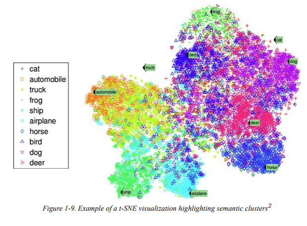\
Một tip sách đề cập là nên reduce số lượng dimensions thông qua dùng ***dimensionality reduction*** trước khi cho vào một thuật toán ML nào. Việc giảm dimensions sẽ giúp ta giữ các dimensions có ảnh hưởng lớn, từ đó giúp máy chạy nhanh hơn, tốn ít memory hơn và cũng perform tốt hơn nữa.

## Day 2 (21/2/2024)
Một task cũng liên quan mà sách đề cập là ***anomaly detection***. \
Ví dụ: Phát hiện giao dịch bất thường để ngăn chặn gian lận, phát hiện lỗi sản phẩm hay tự động loại bỏ các outliers trong dataset trước khi cho học thuật toán. \
Trong quá trình training, hệ thống sẽ được học hầu hết là các instance bình thường và máy sẽ học để nhận biết chúng. Và sau đó khi nhìn một instance mới, máy có thể nói liện instance này là bình thường hay bất thường.\
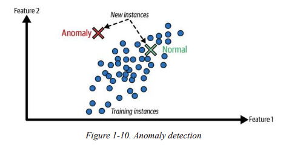\
Một task phổ biển trong **Unsupervised learning** mà sách đề cập là ***association rule learning***, khi mục tiêu của chúng là đào sâu vào data và phát hiện ra những interesting relations giữa các attributes.\
VD giả sử như bạn có một siêu thị. Khi sử dụng task xem nhật ký bán hàng, bạn sẽ nhận ra là những người mua sốt barbecue và khoai tây thì cũng hay mua thịt bò. Do đó, bạn có thể sắp xếp để các mặt hàng đó gần nhau hơn.\

#### Semi-supervised learning
Do việc labelling data tốn nhiều thời gian và công sức, chúng ta thường sẽ có rất nhiều instances không được labelling và ít instances được labelling. Đây gọi là **Semi-supervised learning**.
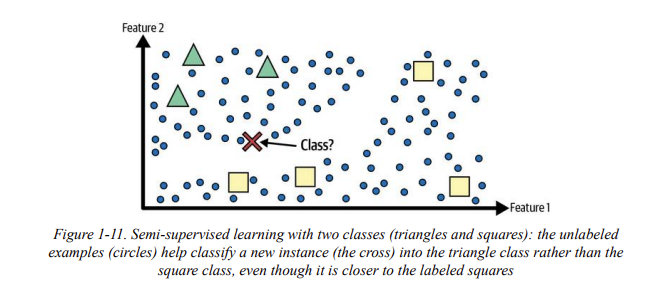\
Một vài service hosting photo như Google Photos là một ví dụ khá hay cho **Semi-supervised learning**. Một khi chúng ta upload toàn bộ ảnh chụp gia đình lên trên service, máy sẽ tự động nhận ra người A có trong ảnh 1, 5 và 11 trong khi người B có trong ảnh 2, 5 và 7. \
-> Đây là phần unsupervised trong thuật toán. 
Giờ tất cả những gì máy cần đó là bạn nói cho máy đây là ai. Thêm label cho từng người (VD: Bố là người A, mẹ là người B) và máy sẽ có thể điền tên toàn bộ mn trong bức ảnh. Điều này giúp ích rất nhiều trong việc searching hình ảnh.\

Hầu hết thuật toán của **semi-supervised learning** là sự kết hợp giữa thuật toán unsupervised và supervised. \
Ví dụ, thuật toán clustering nhóm các instances giống nhau vào 1 group, và các instance chưa được label sẽ được label theo label phổ biến nhất trong từng cluster. Và một khi toàn bộ data được label hết, ta có thể sử dụng dễ dàng **supervised learning**.\

#### Self-supervised learning
Một cách tiếp cận ML khác đó là tạo toàn bộ dataset được label từ tập dataset hoàn toàn không được label. Và đương nhiên, một khi dataset được label thì ta có thể dùng được các thuật toán **supervised learning**. Đây gọi là **self-supervised learning**.\
Ví dụ, bạn có một dataset hình ảnh chưa được label vô cùng lớn. Bạn có thể chọn ngẫu nhiên một phần nhỏ hình ảnh và train model để recover toàn bộ hình ảnh. Trong quá trình training, ảnh được che mặt nạ đen là input cho model và hình ảnh gốc sử dụng như label. \
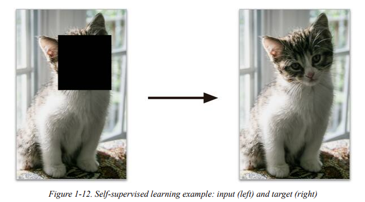\
Mô hình kết quả có thể hữu ích với chính nó, ví dụ có thể sửa được hình ảnh lỗi hoặc loại bỏ những objects không mong muốn trong ảnh. Tuy nhiên, một model dùng **self-supervised learning** thường không phải là mục tiêu cuối cùng của chúng ta. Chúng ta thường tinh chỉnh lại cho 1 task khác mà bạn thực sự mong muốn.

Ví dụ, giả sử bạn có một pet classification model với mục tiêu: Đưa một ảnh của 1 con pet bất kỳ, máy sẽ nói con pet đó chính xác là con vật nào.\
Nếu bạn có rất nhiều hình ảnh pet khác nhau nhưng chưa được label, bạn có thể bắt đầu việc train một image-repairing model sử dụng **self-supervised learning**. Một khi mô hình chạy tốt, bạn có thể phân biệt được các loại pet khác nhau: Ví dụ một hình ảnh con mèo bị tô đen mặt, máy sẽ biết phần đen không phải là mặt con chó. Bạn có thể điều chỉnh model để máy dự đoán hình ảnh pet là con vật gì thay vì chỉ sửa chữa hình ảnh như nếu ở VD trên.\
Bước cuối cùng, tập dữ liệu được gán nhãn được tinh chỉnh: mô hình biết hình ảnh mèo, chó và các con pet khác như nào. Ta sẽ chỉ cần mapping giữa các loài máy đã biết với các label mà chúng ta muốn là được.

Một số người coi **self-supervised learning** là một phần của **unsupervised learning** khi chúng làm việc với dataset không được label. Nhưng **self-supervised learning** sử dụng các data có labels tự tạo trong quá trình training, nên thực chất việc này gần với **supervised learning** hơn. \
Và định nghĩa **unsupervised learning** khi làm các task như ***clustering***, ***dimensionality reduction*** hoặc ***anomaly detection***. Trong khi **self-supervised learning** tập trung làm các task giống **supervised learning** hơn: ***classification*** and ***regression***. Tóm lại, tốt nhất chúng ta vẫn nên xem **self-supervised learning** là một mục riêng biệt.

#### Reinforcement learning
Trong **Reinforcement learning**, model được gọi là ***agent*** được đặt trong một môi trường và thực hiện một số actions khác nhau. Máy sẽ được ***rewards*** khi làm đúng và ***penalties*** khi làm sai. Nó sẽ tự học và thử đi thử lại. Cuối cùng máy đưa ra chiến lược tốt nhất, gọi là ***policy*** để nhận reward lớn nhất qua thời gian. Một policy được định nghĩa khi action mà agent nên chọn trong một tình huống cụ thể.\
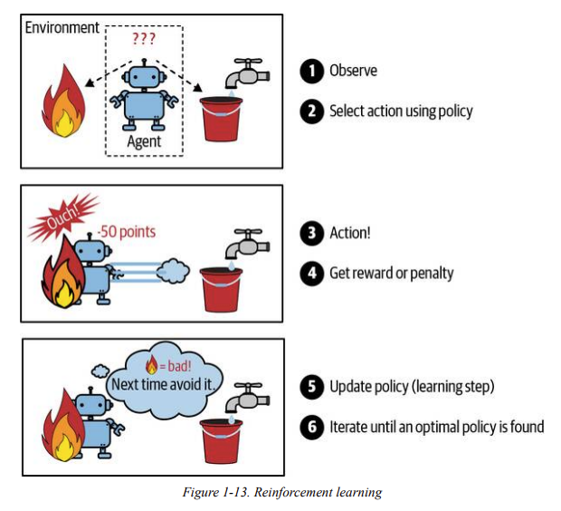\
Ví dụ, **Reinforcement learning** hay sử dụng cho các robot để học cách đi. Hay một ví dụ rất nổi tiếng là DeepMind’s AlphaGo. Alphago chiến thắng Ke Jie, lúc ông đang là kiện tướng cờ vây số 1 thế giới, thông qua việc tự phân tích và tự chơi hàng ngàn games cờ vây khác nhau. Đặc biệt, máy chỉ sử dụng policy đã học và tắt phần learning khi đấu với Ke Jie. Đây là ***offline learning*** và sẽ được đề cập trong phần tiếp theo của bài.

### Batch Versus Online Learning
Một chỉ tiêu dùng để phân biệt ML systems là liệu system có tự động học từ một luồng dữ liệu đầu vào không.
#### Batch learning
Trong ***Batch learning***, hệ thống không tự động học: nó sẽ được train với toàn bộ available data. Điều này sẽ tốn nhiều thời gian và tài nguyên máy tính, vì vây nó thường thực hiện offline. Đầu tiên, hệ thống sẽ được train, sau đó khi nó lên môi trường production thì máy sẽ chạy mà không học thêm nữa mà chỉ áp dụng những thứ nó đã được học. Đây gọi là ***offline learning***.\
Một điều đương nhiên, performance của model sẽ có xu hướng giảm dần qua thời gian đơn giản bởi vì thế giới liên tục thay đổi trong khi mô hình không thay đổi gì cả. Hiện tượng này còn gọi là ***model rot*** hay ***data drift***.

Giải pháp cho việc này là ta cần retrain model thường xuyên đến up-to-date data. Việc này tùy thuộc vào bài toán bạn đang sử dụng: chẳng hạn nếu mô hình của bạn phân biệt chó và mèo, performance sẽ giảm chậm hơn, tuy nhiên nếu phải làm bài toán có data thay đổi liên tục như dự đoán thị trường chứng khoán chẳng hạn, performance sẽ giảm xuống rất nhanh.\
Nếu bạn muốn hệ thống batch learning biết được data mới (như 1 loại spam mới chảng hạn), bạn cần train một version mới cho hệ thống từ full dataset (***không phải chỉ data mới mà phải toàn bộ data***), và replace model cũ bằng 1 cái mới. Dĩ nhiên quá trình training, evaluating và launching một model ML mới có thể dễ dàng thực hiện tự động được. \
Vậy nên, một ***batch learning system*** có thể thay đổi bằng cách đơn giản là update data và retrain lại thường xuyên theo tần suất tùy theo yêu cầu bài toán.

Giải pháp này khá đơn giản và thực hiện tốt, tuy nhiên training full dataset bao giờ cũng tốn nhiều giờ chạy và chúng ta chỉ nên thực hiện cách ngày hoặc thậm chí là cách tuần. Tuy nhiên nếu mô hình cần giải quyết bài toán mà data thay đổi nhanh như chứng khoán, ta cần một giải pháp linh hoạt hơn.\
Một điều cần chú ý thêm là training full dataset yêu cầu rất nhiều tài nguyên máy tính. Nếu ra có rất nhiều data và để máy tự động train from scratch mỗi ngày, nó sẽ làm chúng ta mất nhiều tiền để thực hiện. Và nếu data quá lớn, nó có thể bất khả thi nếu sử dụng ***batch learning***. \
Cuối cùng, nếu hệ thống cần khả năng tự học và có tài nguyên hạn chế (như app điện thoại), việc retrain một dataset siêu lớn tốn hàng giờ sẽ làm chậm quá trình đi rất nhiều.

#### Online learning
Trong ***Online learning***, chúng ta sẽ train system bằng cách cho hệ thống học tăng dần các ví dụ theo thứ tự, từng cá thể hoặc nhóm nhỏ gọi là ***minibatches***. Từng bước máy học rất nhanh và rẻ, system có thể học khi có một data mới đến.\

***Online learning*** phù hợp với các systems mà thay đổi dữ liệu nhanh chóng (VD như phát hiện một pattern mới trong chứng khoán). Nó cũng là 1 good option khi có tài nguyên máy tính hữu hạn, như model train trên một chiếc điện thoại.\
Thêm nữa, ***Online learning*** sử dụng train models trên một tập dataset lớn mà không thế fit được trong memory của 1 máy (cái này còn gọi là ***out-of-core***). Thuật toán sẽ load một phần data, chạy các training steps và lặp lại quá trình đó cho đến khi chạy toàn bộ data.\
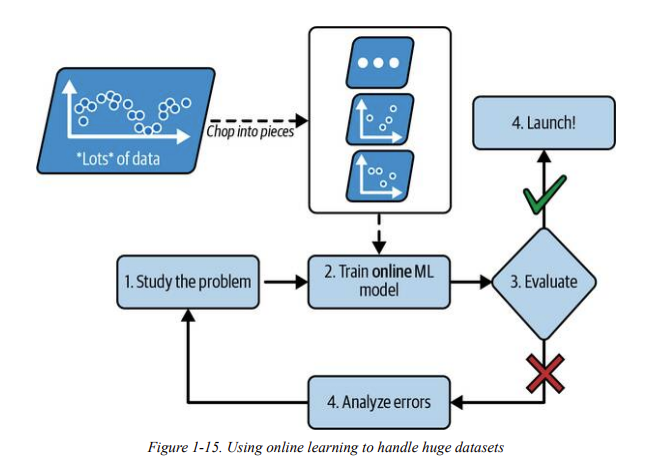\
Một param quan trọng trong ***online learning system*** là cách máy thích nghi với data thay đổi, gọi là ***learning rate***. Nếu ta set learning rate cao, system sẽ thích nghi rất nhanh với data thay đổi nhưng nó cũng xu hướng quên nhanh các data cũ. Ngược lại, nếu ta set learning rate thấp, máy sẽ học chậm hơn, bị ì hơn và ít nhạy cảm hơn sự thay đổi data mới.\
Một thách thức lớn với ***online learning*** là bad data, có thể do một lỗi gì đó hoặc từ một ai đó hack hệ thống. Để giảm thiểu risk này, chúng ta cần monitor system cẩn trọng và nhanh chóng tắt chế độ learning rate nếu cần. 

### Instance-Based Versus Model-Based Learning
Một cách để phân loại ML systems này theo cách mà máy *generalize* - tức là cách mà máy đối mặt với dữ liệu mới mà không có trong dữ liệu train, cách chúng làm việc và cách thức như nào? Có một good performance trên tập training data là tốt, nhưng mục tiêu quan trọng hơn vẫn là dự đoán được những dữ liệu mới.
#### Instance-based learning
Một hình thức học đơn giản nhất là cách học thuộc lòng. Nếu chúng ta muốn tạo một filter spam như cách này, máy sẽ đánh dấu các emails giống hệt với các email mà người dùng đã đánh dấu trước đó. Cách này không tệ nhất nhưng chắc chắn cũng không phải tốt nhất.\
Thay vì đánh dấu các emails giống hệt spam emails, spam filter của chúng ta có thể thiết kế để đánh dấu các emails gần giống với spam emails thôi. Điều này cần *measure of similarity* giữa các emails. Một cách đơn giản để tính là đếm số chữ giống nhau giữa emails. Máy sẽ đánh dấu là spam emails nếu emails có nhiều từ chung với các spam emails đã biết.\
Đây gọi là ***instance-based learning***: máy sẽ học các ví dụ, sau đó xử lý các case mới dựa trên việc tính toán similarity khi so sánh với các VD đã học. \
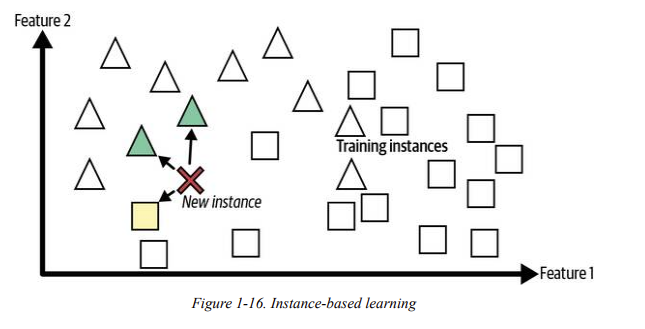

#### Model-based learning and a typical machine learning workflow
Một cách khác để generalize tập hợp ví dụ là build model từ các ví dụ và sử dụng model đó để dự đoán. Đây gọi là ***model-based learning***.
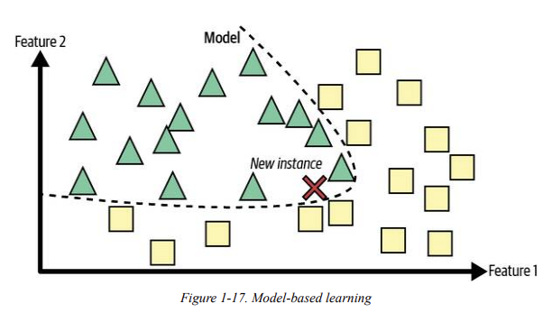\
Ví dụ, giả sử bạn muốn biết tiền có làm cho con người trở nên hạnh phúc không. Ta có thể sử dụng xem data trong bảng dưới sau.\ 
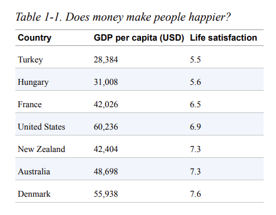\
TA sẽ plot dưới dạng sau:\
\
Ta có thể dễ dàng thấy 1 trend ở đây. Dù data có một số điểm nhiễu, ta có thể thấy từ plot là sự hài lòng cuộc sống tỷ lệ thuận với GDP đầu người. Bước này gọi là ***model selection***: khi ta chọn một *linear model* sự hài lòng cuộc sống với 1 attribute, GDP đầu người\
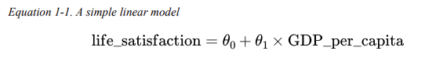\
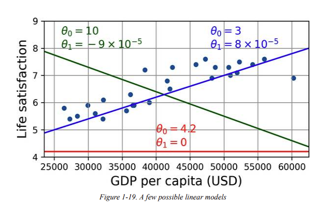\
Trước khi bạn sử dụng model, ta cần xác định rõ param trong công thức tính model. Vậy làm sao để biết giá trị nào cho model có kết quả tốt nhất? Để trả lời câu hỏi này, bạn cần định nghĩa ***utility function*** (hoặc ***fitness function***) để tính toán xem model tốt đến mức nào, hoặc có thể định nghĩa ***cost function*** tính toán model tệ đến mức nào. \
VD như linear regression model, chúng ta thường tính cost function thông qua tìm distances giữa giá trị model dự đoán với tập training (MSE, RMSE). Từ đó, ta có thể tính được giá trị param để model tốt nhất.\
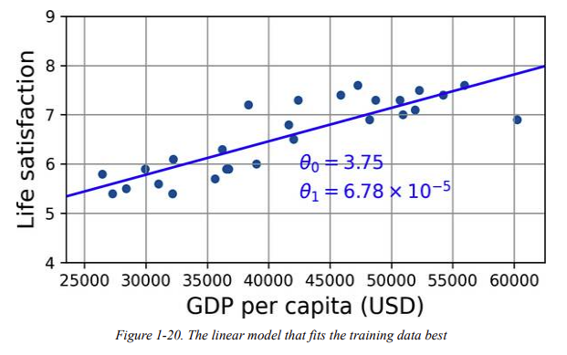\

## Main Challenges of Machine Learning
Tóm gọn lại, task chính của bạn sẽ là chọn model và train nó trên một tập data, và hai thứ có thể gặp vấn đề là *bad model* và *bad data*. \
Hãy xem một số TH *bad data*
### Insufficient Quantity of Training Data - Không đủ dữ liệu huấn luyện
Trong thực tế, khi ta muốn dạy đứa trẻ một thứ gì đó, chẳng hạn quả tạo, chúng ta sẽ chỉ quả táo và nói với đứa trẻ. Có thể mất 1 hoặc 1 số lần lặp đi lặp lại, đứa trẻ sẽ có thể nhận ra được quả táo trong mọi hình dạng hay màu sắc.\
Machine Learning không hẳn như thế: chúng cần rất nhiều data để thuật toán học và làm việc được chính xác kể cả ta làm bài toán đơn giản hoặc phức tạp. 
### Nonrepresentative Training Data - Tập training data không có tính đại diện
Để generalize tốt, một điều quan trọng là tập training data cần có tính đại diện cho các case mới mà chúng ta muốn generalize. Điều này đúng cho cả khi dùng ***instance-based learning*** hay ***model-based learning***.\
Ví dụ, tập hợp quốc gia mà bạn sử dụng trước đó cho việc training linear model không perfectly representative; tức không có quốc gia mà GDP đầu người dưới `$23,500` hoặc cao hơn `$62,500`. \
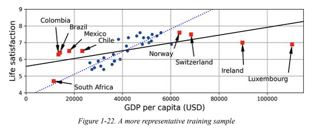\
Nếu ta train model dựa trên data này thì ta sẽ có đường thẳng, trong khi với data cũ (không có các ô vuông đó) thì model sẽ theo đường chấm. Ta có thể dễ dàng nhận ra việc thêm một số điểm dữ liệu quốc gia sẽ làm thay đổi rất nhiều hình dạng model. Và bạn có thể nhận ra là một simple linear model sẽ thường không bao giờ hoạt động tốt.\
Tóm lại, việc không sử dụng tập training set có tính dại diện sẽ làm việc bạn train model dự đoán các kết quả không chính xác và sai lệch nhiều.

Tuy vậy, việc lựa chon training set có tính representative khó hơn tưởng tượng: nếu dataset quá nhỏ, bạn có thể bị ***sampling noise*** (dữ liệu không đại diện do sự cố như outlier) hoặc kể cả dataset lớn cũng có thể không mang tính representative nếu phương pháp sampling lỗi. Đây gọi là ***sampling bias***.\
Sách đưa một ví dụ nổi tiếng về ***sampling bias*** khi nói về cuộc bầu cử tổng thống Mỹ giữa Landon vs Roosevelt. Tờ báo Literary Digest làm một cuộc khảo sát lớn bằng cách gửi mail cho 10 triệu người hỏi ai là người chiến thắng. có 2.4 triệu người trả lời và dự đoán 57% người vote cho Landon. Nhưng thực tế Roosevelt thắng với 62% vote. Tại sao lại vậy? Đó là do phương pháp sampling của Literary Digest bị lỗi:
 - Đầu tiên, khi Literary Digest khi thu thập địa chỉ để làm poll, báo đã sử dụng danh bạ điện thoại, danh sách độc giả, danh sách thành viên các CLB hay tương tự. Danh sách thường sẽ là những người giàu có, mang xu hướng theo Đảng Cộng hóa (ủng hộ Landon)
 - Thứ hai, dưới 25% người được hỏi có câu trả lời. Những người này có thể k quan tâm chính trị, không thích tờ báo hoặc các nhóm khác và phần lớn trong số này lại thích Roosevelt. Đây là một dạng đặc biệt của ***sampling bias*** là ***nonresponse bias***.
 - 
### Poor-Quality Data - Data không chất lượng
Dĩ nhiên, khi data không chất lượng như đầy lỗi, outliers hay nhiễu,... system sẽ rất khó khăn trong việc detect các patterns không rõ ràng và hoạt động không tốt như kỳ vọng. Chính vì vậy, việc dành thời gian clean data là vô cùng quan trọng. Thực tế là, hầu hết DS sử dụng phần lớn thời gian của mình để làm công việc này.\
- Nếu có một số instances nào là outliers, đơn giản là loại bỏ hoặc fix chúng thủ công.
- Nếu có một số instances là thiếu dữ liệu (VD như 5% người không điền tuổi), ta phải quyết định xem ta bỏ attribute đó, bỏ các instances đó, fillna chúng hay train một model có feature vs model không có feature đó.

### Irrelevant Features - Features không liên quan
Như câu nói phổ biến "garbage in, garbage out", ta sẽ chỉ có model tốt khi tập training data có đủ các features cần thiết và không có quá nhiều các features không liên quan. Một phần quan trọng trong sự thành công một dự án ML là có được 1 tập features tốt để train. Quá trình này gọi là ***feature engineering***, bao gồm:
- ***Feature selection***: Lựa chọn các features tốt trong các features 
- ***Feature extraction***: Kết hợp các features thành 1 feature có ích cho model, VD như thuật toán dimensionality reduction đã đề cập ở trên
- Tạo feature mới bằng cách thu thập thêm data

Bây giờ chúng ta sẽ xem một số VD về ***bad model***
### Overfitting the Training Data
Giả sử bạn đến một quốc gia, bạn vô tình gặp phải một ông tài xế lừa đảo và nói rằng mọi tài xế đất nước này đều là lừa đảo. Overgeneralizing là một điều con người hay mắc phải và máy cũng có thể dính bẫy này nếu ta không cẩn thận.\
Đó là ***overfitting***, khi model perform tốt trên tập training data nhưng thực chất nó không generalize tốt. \
Dưới đây là 1 VD về một mô hình phức tạp về mức hài lòng cuộc sống người dân và model bị overfit quá mức. Kế cả khi chúng tốt hơn một simple linear model thì liệu chúng ta có thể tin tưởng được kết quả predict của chúng không?\
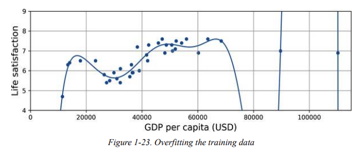\

