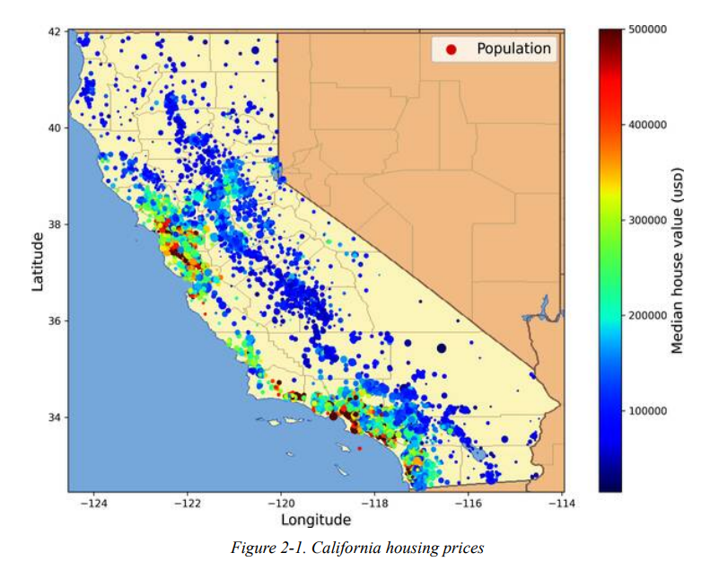
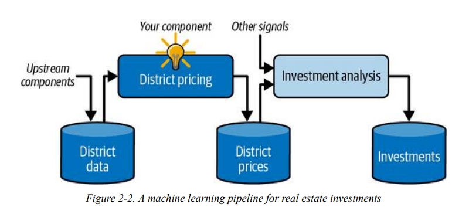
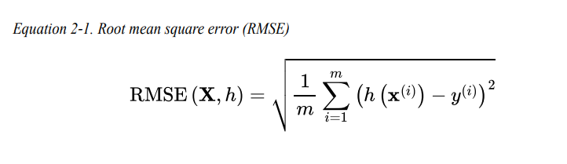
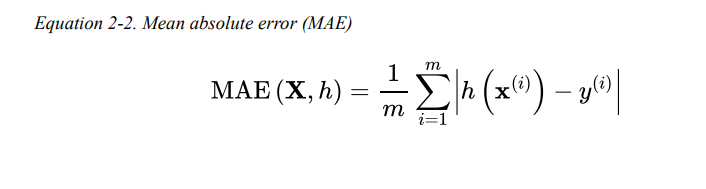
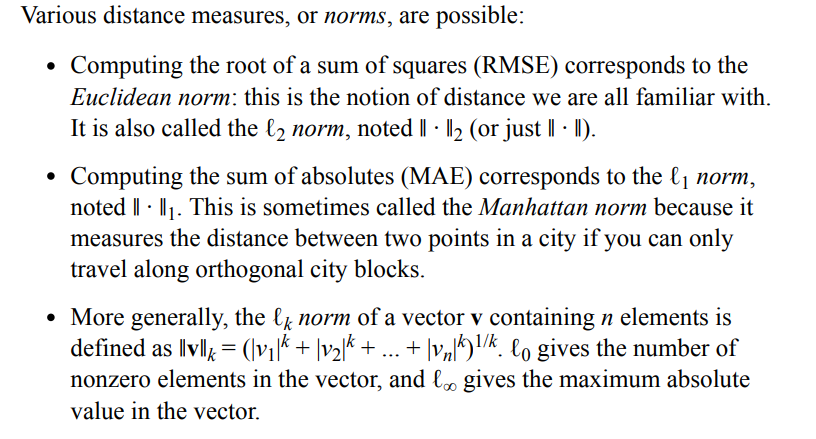
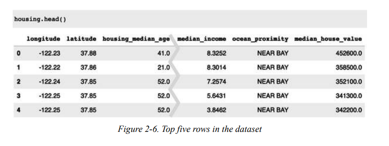
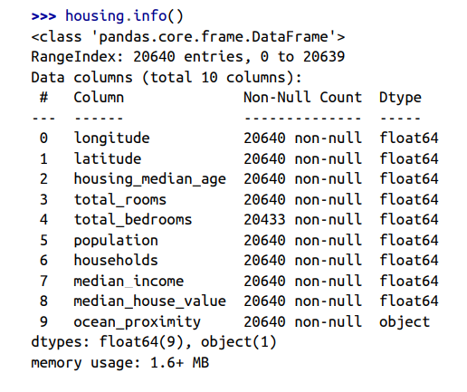

# CHAPTER 2: End-to-End Machine Learning Project
Trong chapter này, bạn sẽ làm việc với 1 ví dụ project từ đầu đến cuối và giả sử bạn được thuê làm DS cho 1 công ty Bất động sản. Ví dụ này chỉ là hư cấu, tuy nhiên mục tiêu là miêu tả các steps chính của một project ML, chứ không học bất cứ cái gì về công việc Bất động sản.\
Các steps chính chúng ta sẽ thực hiện:
- Nhìn toàn bộ bức tranh lớn
- Lấy data
- Explore và visualize data để có insights
- Chuẩn bị data cho thuật toán ML
- Chọn model và train nó
- Fine-tune model
- Trình bày giải pháp
- Launch, monitor và maintain system

## Working with Real Data
Bài có giới thiệu và gợi ý việc chúng ta nên làm việc những data thực tế chứ không phải data tự tạo. Có rất nhièu nguồn datasets cho bạn lựa chọn và trải dài trong rất nhiều domain.
- Popular open data repositories:
  - OpenML.org
  - Kaggle.com
  - PapersWithCode.com
- UC Irvine Machine Learning Repository
  - Amazon’s AWS datasets
  - TensorFlow datasets
- Meta portals (they list open data repositories)
  - DataPortals.org
  - OpenDataMonitor.eu
- Other pages listing many popular open data repositories:
  - Wikipedia’s list of machine learning datasets
  - Quora.com
  - The datasets subreddit

Trong chapter này, chúng ta sẽ sử dụng dữ liệu California Housing Prices dataset. Dataset dựa trên data điều tra dân số California năm 1990. Dataset này không phải dữ liệu gần đây tuy nhiên ta cũng có thể thấy và học rất nhiều thứ chất lượng từ dataset. Tác giả cũng thêm và bớt một số features nhằm mục đích dạy học.\
\
## Look at the Big Picture
Chào mừng đến với Machine Learning Housing Corporation! Nhiệm vụ đầu tiên đó là sử dụng data điều tra dân số California để build model cho dự đoán gía nhà trong bang. \
Data bao gồm một số metrics như Dân số, Thu nhập trung bình, Giá nhà trung bình theo từng block group trong California. Block group là đơn vị địa lý nhỏ nhất mà Cục điều tra dân số Hoa Kỳ công bố dữ liệu mẫu (một nhóm khối thông thường có dân số từ 600 đến 3,000 người). Giờ chúng ta sẽ gọi là "*quận*" cho ngắn.\
Model của bạn nên học từ data này và có thể dự đoán giá nhà trung bình ở bất cứ quận nào, khi được cho đủ các inputs.\
### Frame the Problem
Câu hỏi đầu tiên mà bạn nên hỏi sếp của bạn là chính xác business objective là gì? Build model có thể không phải là mục tiêu cuối cùng. Liệu công ty kỳ vọng có thể sử dụng và có lợi ích gì từ model của bạn?\
Biết mục tiêu vô cùng quan trọng bởi vì nó sẽ quyết định việc bạn đặt vấn đề như thế nào, thuật toán nào bạn sẽ sử dụng, performance measure nào bạn sẽ dùng để đánh giá model hay công sức của bạn sẽ bỏ ra để điều chỉnh model đó.\
Sếp của bạn trả lời rằng output model của bạn (như kết quả dự đoán của giá nhà trung bình trong quận) sẽ được đưa vào một hệ thống ML khác, cùng nhiều thông tin khác. Hệ thống ML sau sẽ quyết định liệu nó đáng để invest vào lĩnh vực cụ thể này không. Do nó ảnh hưởng đến doanh thu nên điều này thực sự rất quan trọng.\
Câu hỏi tiếp theo hỏi sếp của bạn là giải pháp hiện tại như thế nào (nếu có). Tình trạng hiện tại thường sẽ cho bạn một reference để đánh giá hiệu suất cũng như các insights để giải quyết vấn đề. \
Sếp bạn trả lời rằng giá nhà quận đang được đánh giá thủ công qua các chuyên gia: 1 team luôn thu thập thông tin up-to-date về quận, và nếu họ không thể có được giá nhà trung bình, họ sẽ sử dụng các rules phức tạp để xác định.\
\
Rõ ràng việc này sẽ tốn rát nhiêù thời gian và nguồn lực, và ước tính của họ sẽ không tốt. Trong trường hợp họ tìm được giá trung bình, họ nhận ra là ước tính của họ lệch hơn 30%. \
Đó là tại sao công ty nghĩ rằng sẽ hữu dụng khi train model để dự đoán giá nhà trung bình quận nếu được đưa các input cần thiét. Dữ liệu điều tra dân số là một tập dữ liệu tuyệt vời để khai thác cho mục đích này, vì nó bao gồm giá nhà trung bình của hàng ngàn quận, cũng như các dữ liệu khác.\

Và với tất cả thông tin đó, bạn đã sẵn sàng cho việc thiết kế hệ thống. \
Đầu tiên, bạn cần quyết định loại training supervision nào mà model bạn sẽ dùng? Đó là supervised, unsupervised, semi-supervised, self-supervised, hay reinforcement learning task? Và đó là classification task, a regression task hay cái gì khác? Bạn nên sử dụng batch learning hay online learning? Đó là những thứ chúng ta có thể tự trả lời trước khi bắt đầu làm.\
Đây rõ ràng là một ***supervised learning*** task, do model này được train với các labeled examples (từng instances sẽ gắn với một expected output, ví dụ như tên quận gắn với giá nhà của quận đó). Đây là một ***regression*** task, do model được xây nhằm mục đích dự đoán giá trị. Đặc biệt hơn, đây là ***multiple regression***, do hệ thống sử dụng nhiều features để dự đoán. Đây cũng là ***univariate regression***, do ta chỉ dự đoán một giá trị đơn lẻ theo từng quận. Nếu bạn muốn dự đoán nhiều giá trị từng quận, đó sẽ là ***multivariate regression***. Cuối cùng, luồng dữ liệu không liên tục đến hệ thống cũng như không có nhu cầu việc dữ liệu thay đổi nhanh chóng, đồng thời data nhỏ đủ để fit với memory, vì vậy ***batch learning*** sẽ làm việc tốt.

### Select a Performance Measure
Step tiếp theo bạn cần làm là lựa chọn một performance measure. Một performance measure phổ biến cho các regression problems là Root Mean Square Error (RMSE). Chỉ số có ý tưởng dựa trên việc tính toán mức độ lỗi mà hệ thống mắc phải khi dự đoán, với trọng số gán cao hơn cho các lỗi lớn.\
Dưới đây là công thức RMSE:\
\
Dù RMSE thường được coi là một performance measure ưu tiên cho các regression tasks, tuy nhiên trong một số trường hợp, bạn nên sử dụng các cách đánh giá khác.\
Ví dụ, data chúng ta có rất nhiều outlier districts. Trong trường hợp này, chúng ta có thể xem xét sử dụng Mean Absolute Error (MAE, còn gọi là Average Absolute Deviation):\
\
RMSE và MAE đều dùng để tính khoảng cách giữa 2 vector: vector điểm dự đoán và vector điểm giá trị target. Tuy nhiên:\
\
Norm càng lớn, chỉ số sẽ càng tập trung vào các giá trị lớn mà bỏ qua các giá trị nhỏ. Chính vì vậy, RMSE nhạy cảm với outliers hơn MAE. Tuy nhiên, nếu outliers hiếm (như trong một bell-shaped curve) thì RMSE hoạt động khá tốt và thường được ưu tiên hơn.\
### Check the Assumptions
Cuói cùng, đó là một điều tốt khi list và verify các asssumptions đã được đưa ra từ trước đến nay. Điều này sẽ giúp bạn có thể phát hiện được các vấn đề nghiêm trọng sớm.\
Ví dụ, giá nhà trong quận mà máy bạn predict ra được được đưa vào một ML system khác, và bạn đang giả định giá này đang sử dụng như vậy. Nhưng nếu như cái downstream system kia convert giá thành các categories (như "cheap", "medium" hay "expensive") và sử dụng các categories này thay vì bản thân các giá? \
Trong trường hợp này, việc cố gắng lấy giá một cách hoàn hảo không thực sự hoàn toàn quan trọng; system chỉ cần xếp vào các categories cho đúng. Và nếu vậy, bài toán sẽ nên được đưa về một *classfication task*, thay vì *regression task*. Và rõ ràng bạn không muốn phát hiện điều này sau khi làm một regression system hàng tháng trời!\
May mắn thay, sau khi làm việc cùng các team chịu trách nhiệm về downstream system, bạn tự tin là họ rất giá nhà dự đoán cuối cùng chứ không chỉ là phân vào các categories.
## Get the Data 
Bài hướng dẫn cơ bản về việc theo dõi và sử dụng code trong Google Collab. Trong phàn note này, theo dõi trong file ipynb được code cùng trong folder Chapter.
### Take a Quick Look at the Data Structure
Chúng ta sẽ bắt đầu với việc xem 5 dòng đầu tiên của data\
\
Từng dòng biểu diễn từng quận. Ta có 10 attributes khác nhau: longitude, latitude, housing_median_age, total_rooms, total_bedrooms, population, households, median_income, median_house_value, and ocean_proximity.\
Ta sử dụng tiếp info() để có một mô tả nhanh về data, cụ thể như số dòng, type, hoặc số lượng non-null values\
\
Ta thấy có 20640 instances trong dataset, thực ra tập khá nhỏ so với tiêu chuẩn cho một mô hình học máy nhưng nó cũng khá hoàn hảo để chúng ta bắt đầu. Bạn có thể nhận ra là, cột total_bedrooms có 20433 non-null values, tức là có 207 quận đang missing dữ liệu. \
Tất cả attributes là dạng *numerical*, ngoại trừ ocean_proximity. Cột này dạng *object*, vì vậy chúng có thể chứa bất cứ đối tượng nào trong Python. 

